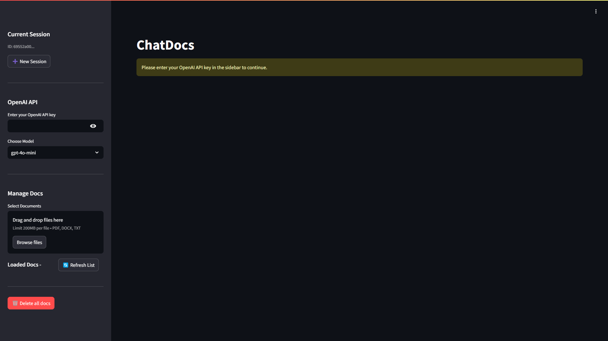
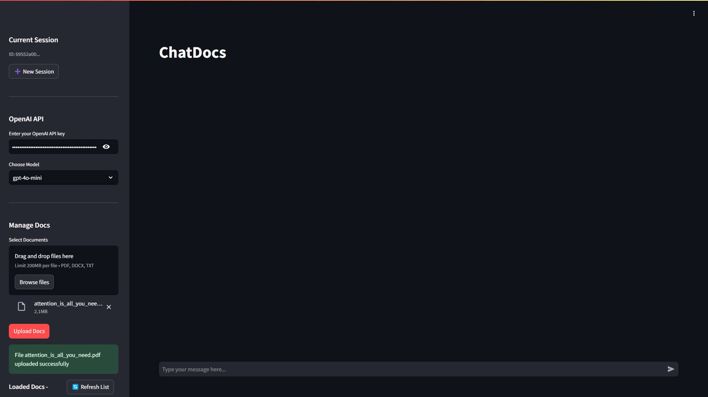
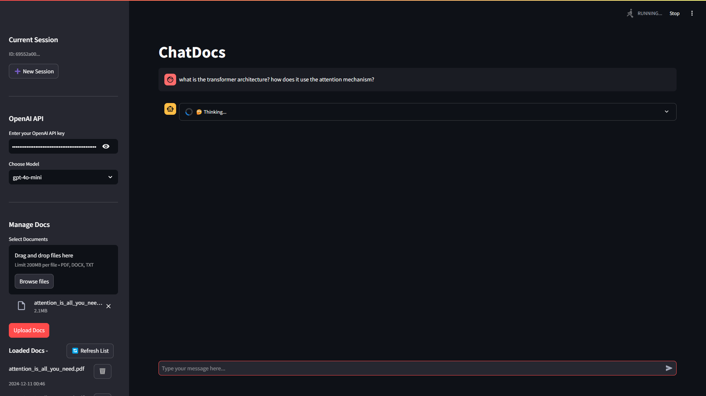
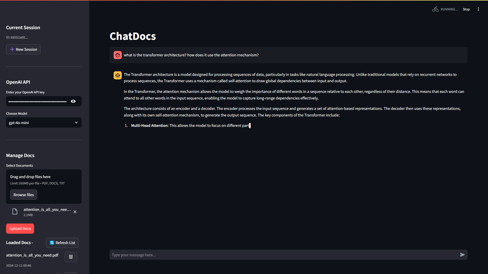
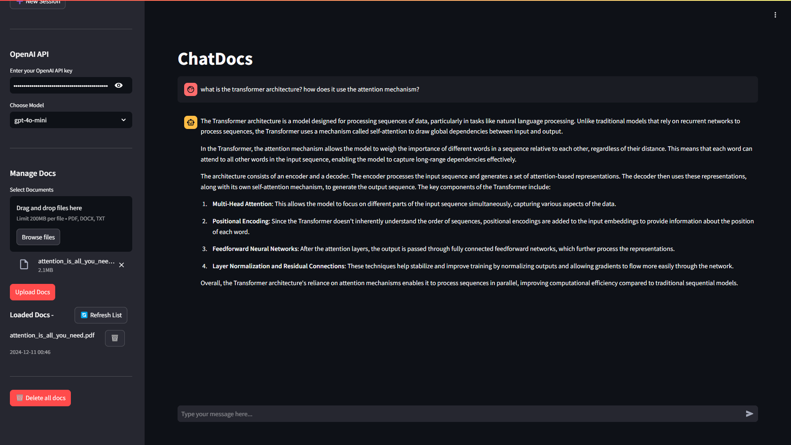

# ChatDocs - RAG based Chat Assistant

ChatDocs is an intelligent document chat system that allows users to upload documents and interact with them through natural language queries. The system uses RAG (Retrieval Augmented Generation) to provide accurate, context-aware responses based on the uploaded documents.

<details>
    <summary>📸<b> Screenshots</b></summary><br>


<p align="center"><em>Landing Page</em></p><br>


<p align="center"><em>Document Upload</em></p><br>


<p align="center"><em>Generating Response | Thining...</em></p><br>


<p align="center"><em>Streaming Response</em></p><br>



</details>
<br>
<details>
    <summary><b>🌟 Features</b></summary>
<br>

- **Document Management**
  - Support for multiple file formats (PDF, DOCX, TXT)
  - Easy document upload and deletion
  - Automatic document indexing and embedding

- **Intelligent Chat**
  - Context-aware responses using RAG
  - Chat history tracking
  - Support for multiple GPT models *(more coming soon)*
  - Session management for continuous conversations *(experimental)*

- **Modern Architecture**
  - `FastAPI` backend for high performance
  - `Streamlit` frontend for user-friendly interface
  - `ChromaDB` vectorstore for efficient document retrieval
  - `SQLite` database for persistent storage

- **Easy Integration**
  - Simple API endpoints for document management and chat
  - Streamlit UI for intuitive user interaction
  - OpenAI GPT models for powerful conversational AI

- **Simple to Setup**
  - Minimal dependencies
  - Quick installation and configuration
  - Detailed documentation and usage examples

</details>

## 🔧 Toolkit

### Backend Components

- **FastAPI Server**: Handles API endpoints and business logic
- **Chroma Vector Store**: Manages document embeddings and similarity search
- **SQLite Database**: Stores document metadata and chat history
- **LangChain**: Orchestrates the RAG pipeline and document processing
- **Pydantic Models**: Defines data models for API requests and responses
- **OpenAI API**: Provides access to GPT models

### Frontend Components

- **Streamlit UI**: Provides an intuitive interface for:
  - Document upload and management
  - Chat interface
  - Model selection


## 💻 Installation

### Prerequisites

```bash
# Python 3.8 or higher is required
python --version

# Create and activate virtual environment
python -m venv venv
source venv/bin/activate  # Linux/Mac
# or
.\venv\Scripts\activate  # Windows
```

### Running Locally

1. Clone the repository:
```bash
git clone https://github.com/yourusername/chatDocs.git
cd chatDocs
```

2. Install backend dependencies:
```bash
pip install -r requirements.txt
```

3. Create `.env` file:
```bash
echo "OPENAI_API_KEY=your_api_key_here" > .env
```

4. Initialize the database:
```bash
python init_db.py
```

## 🚀 Booting the Application

*Start the application using the provided script:*
```bash
source run.sh
```

### Alternatively

1. *Start the Uvicorn server:*
```bash
uvicorn main:app --reload --host 0.0.0.0 --port 8000
```

2. *Start the Streamlit app:*
```bash
cd frontend
streamlit run app.py
```

3. Access the application: *(locally)*
- ChatDocs App: http://localhost:8501
- API Documentation: http://localhost:8000/docs

## 📁 Project Structure

```
chatDocs/
├── README.md
├── requirements.txt
├── .env
├── api.py
├── app.py
├── RAG/
│   ├── __init__.py
│   ├── chroma_utils.py
│   ├── db_utils.py
│   ├── langchain_utils.py
│   └── pydantic_models.py
└── chroma_db/
    └── ...
```

## 🔍 API Endpoints

- `POST /setApiKey`: Set OpenAI API key
- `POST /chat`: Send queries and receive responses
- `POST /uploadDoc`: Upload new documents
- `GET /listDocs`: List all uploaded documents
- `POST /deleteDoc`: Delete a document
- `POST /clearAllDocs`: Delete all documents
- `POST /clearSession`: Delete all chat history

## 🛠 Configuration

### Environment Variables  *(Optional)*

Create a `.env` file with the following configurations:

```env
OPENAI_API_KEY=your_api_key_here
```

### Supported File Types

- PDF (`.pdf`)
- Microsoft Word (`.docx`)
- Text (`.txt`)


## 🤝 Contributing

Contributions are always welcome! Here's how you can help:

1. Fork the repository
2. Create your feature branch (`git checkout -b feature/AmazingFeature`)
3. Commit your changes (`git commit -m 'Add some AmazingFeature'`)
4. Push to the branch (`git push origin feature/AmazingFeature`)
5. Open a Pull Request

## 📝 License

This project is licensed under the MIT License - see the [LICENSE](LICENSE) file for details.

## 🔐 Security

- The application uses session-based authentication
- Documents are stored securely in the Chroma vector store
- API endpoints are protected against common vulnerabilities

## ⚠️ Known Issues and Limitations

1. Large PDF files might take longer to process.
2. File size `>200 MB` is not supported.
2. Memory usage increases with the number of documents
3. Currently supports only text-based documents

## 🗺 Future Tasks

- [x] Implement batch document upload
- [ ] Add support for other LLMs (Groq, Gemma, Claude, Llama3.3, etc.)
- [ ] Add support for more file types
- [ ] Add SOTA document chunking configurations
- [ ] Improve response quality with better system prompts
- [ ] Implement user authentication

## ⛑️ Support

For support, please:
1. Check the [documentation](http://localhost:8000/docs)
2. Open an issue on GitHub
3. Contact the maintainer at [argish.official@gmail.com](mailto:argish.official@gmail.com)